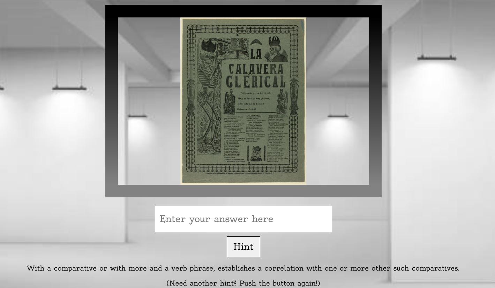

# Guess the Art!

This project is a webpage that generates a random artwork for the users to guess its name. A hint button is provided that reveals a word definition from the artwork’s title. It was originally built as part of a web programming course to practice JavaScript, APIs, and DOM manipulation.

## APIs Used
[Institute of Chicago API](https://api.artic.edu/docs/)\
[Free Dictionary API](https://dictionaryapi.dev/) 

## Try It Out
[Click here to Guest the Art!](index.html)

## Take a Peek

